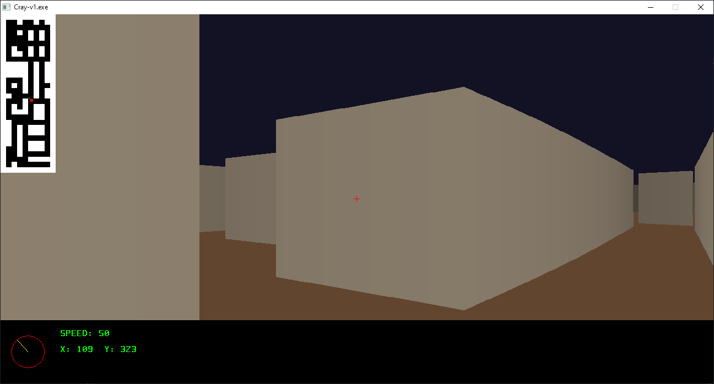

# C RAY



## install
```ps
git clone https://github.com/urancore/C_RAY
cd C_RAY/src
make
```

## info
> [!WARNING]
> Windows: запускайте make через mingw32


> map editor'а нет, нарисовать свою карту можно в файле src/ray.c

**отредактируйте**
```
12. game_object_t map[MAP_HEIGHT][MAP_WIDTH] = {
		{D_W,D_W,D_W,D_W,D_W,D_W,D_W,D_W,D_W,D_W},
		{D_W,D_F,D_F,D_W,D_F,D_F,D_W,D_F,D_W,D_W},
		{D_W,D_F,D_F,D_F,D_F,D_F,D_F,D_F,D_F,D_W},
		{D_W,D_F,D_F,D_W,D_F,D_W,D_F,D_W,D_F,D_W},
		{D_W,D_F,D_F,D_F,D_F,D_W,D_F,D_W,D_F,D_W},
		{D_W,D_F,D_F,D_F,...
```
`D_W = wall`

`D_F = floor`

---
### files
- **Основной файл:** src/game.c
- **Все бинды и инициализации:** src/initfuncs.c
- **HUD настройки:** src/hud.c
- **Настройки рендера:** src/include/core/core_types.h
- **Битмап шрифта:** src/include/text/font.h
- **Функции рендера:** src/R_renderer.c
- **Функции рисования примитивов:** src/render.c
- **Функции рисования мини-карты и карты:** src/map.c


## Thank
1. [vasyan5546231](https://github.com/vasyan5546231)
2. [hexadec1mal](https://github.com/hexadec1mal)
