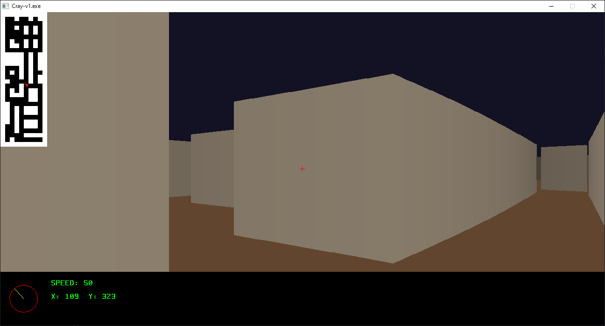

# C RAY



## install
```ps
git clone https://github.com/urancore/C_RAY
cd C_RAY
make
```

## info
> [!WARNING]
> Windows: запускайте make через mingw32


> map editor'а нет, нарисовать свою карту можно в файле [ray.c](https://github.com/urancore/C_RAY/blob/571ef144afe77cce619989a1b3486a53c927ffca/ray.c#L11)

**отредактируйте**
```
game_object_t map[MAP_HEIGHT][MAP_WIDTH] = {
	{D_W,D_W,D_W,D_W,D_W,D_W,D_W,D_W,D_W,D_W},
	{D_W,D_F,D_F,D_W,D_F,D_F,D_W,D_F,D_W,D_W},
	{D_W,D_F,D_F,D_F,D_F,D_F,D_F,D_F,D_F,D_W},
	{D_W,D_F,D_F,D_W,D_F,D_W,D_F,D_W,D_F,D_W},
	{D_W,D_F,D_F,D_F,D_F,D_W,D_F,D_W,D_F,D_W},
	{D_W,D_F,D_F,D_F,...
```
`D_W = wall`

`D_F = floor`

---
### files
- **Основной файл:** [game.c](https://github.com/urancore/C_RAY/blob/571ef144afe77cce619989a1b3486a53c927ffca/game.c)
- **Все бинды и инициализации:** [initfuncs.c](https://github.com/urancore/C_RAY/blob/571ef144afe77cce619989a1b3486a53c927ffca/initfuncs.c)
- **HUD настройки:** [hud.c](https://github.com/urancore/C_RAY/blob/571ef144afe77cce619989a1b3486a53c927ffca/hud.c#L7)
- **Настройки рендера:** [include/core/core_types.h](https://github.com/urancore/C_RAY/blob/571ef144afe77cce619989a1b3486a53c927ffca/include/core/core_types.h)
- **Битмап шрифта:** [include/text/font.h](https://github.com/urancore/C_RAY/blob/571ef144afe77cce619989a1b3486a53c927ffca/include/text/font.h)
- **Функции рендера:** [R_renderer.c](https://github.com/urancore/C_RAY/R_renderer.c)
- **Функции рисования примитивов:** [render.c](https://github.com/urancore/C_RAY/blob/571ef144afe77cce619989a1b3486a53c927ffca/renderer.c)
- **Функции рисования мини-карты и карты:** [map.c](https://github.com/urancore/C_RAY/blob/571ef144afe77cce619989a1b3486a53c927ffca/R_renderer.c)


## Thank
1. [vasyan5546231](https://github.com/vasyan5546231)
2. [hexadec1mal](https://github.com/hexadec1mal)
